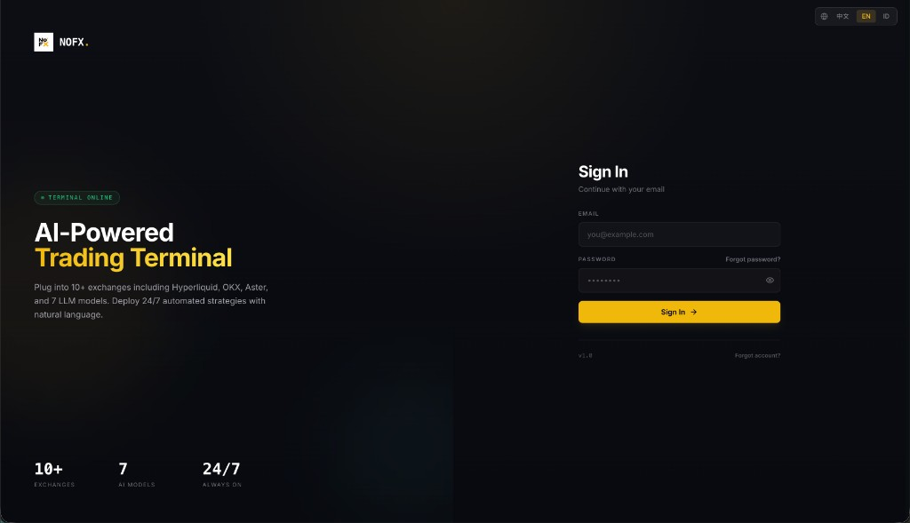
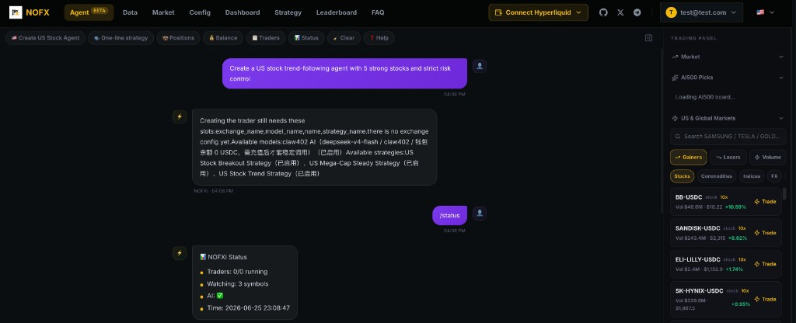
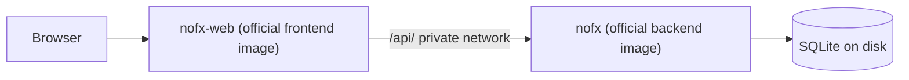

# NOFX on Render

> One-click self-hosted NOFX: an AI-powered trading terminal with multi-exchange support, strategy studio, and a conversational agent.

**Repository:** [render-examples/nofx-render-template](https://github.com/render-examples/nofx-render-template)

This template deploys [NOFX](https://github.com/NoFxAiOS/nofx) on Render using the **official GHCR images** from upstream (`nofx-backend` + `nofx-frontend`). Same split as upstream `docker-compose.prod.yml`: private API service, public web UI, SQLite on a persistent disk. No custom Dockerfile in this repo: everything is defined in `render.yaml`.

**Screenshots** (from a Render deploy):

---

## Table of contents

- [Why deploy NOFX on Render](#why-deploy-nofx-on-render)
- [What gets deployed](#what-gets-deployed)
- [Quickstart](#quickstart)
- [Configuration](#configuration)
- [Cost breakdown](#cost-breakdown)
- [Upgrading](#upgrading)
- [Troubleshooting](#troubleshooting)
- [Credits and license](#credits-and-license)

---

## Why deploy NOFX on Render

- **Official upstream images** — `ghcr.io/nofxaios/nofx/nofx-backend` and `nofx-frontend` at `:latest` (pin tags in `render.yaml` for production).
- **Blueprint-only deploy** — `render.yaml` defines services, disk, and secrets; no merge Dockerfile to maintain in this template repo.
- **Persistent SQLite** — 5 GB disk on the backend service at `/app/data/data.db`.
- **Matches upstream layout** — Frontend nginx proxies `/api/` to the private `nofx` backend on port 8080 (Render private network).

---

## What gets deployed

| Resource | Type | Plan | Purpose |
|----------|------|------|---------|
| `nofx` | Private service (image) | Starter | Go API + SQLite disk |
| `nofx-web` | Web (image) | Starter | React UI + nginx (public URL) |
| `nofx-data` | Disk 5 GB | — | SQLite at `/app/data/data.db` |

Region: **Oregon** (`oregon`).

Open the **`nofx-web`** service URL after deploy (not the private backend).

---

## Quickstart

1. Click **[Deploy to Render](https://render.com/deploy-template/api/github/start?template_repo=nofx-render-template)**. GitHub forks this template into your account.
2. Review auto-generated secrets on the **`nofx`** service: `JWT_SECRET`, `DATA_ENCRYPTION_KEY`.
3. Click **Apply**. First deploy typically takes **5–10 minutes**.
4. Open the **`nofx-web`** URL. Create the single admin account on first visit if prompted.
5. In **Config**, add AI models and exchange keys, then create a trader or use the **Agent** tab.

---

## Configuration

### Required secrets

None at Apply time. LLM and exchange keys are set in the UI after login.

### Auto-generated secrets (backend service)

| Env var | Purpose |
|---------|---------|
| `JWT_SECRET` | Session tokens |
| `DATA_ENCRYPTION_KEY` | Encrypts sensitive fields at rest |

### Wired in `render.yaml`

| Env var | Value |
|---------|--------|
| `DB_TYPE` | `sqlite` |
| `DB_PATH` | `/app/data/data.db` |
| `TZ` | `UTC` |
| `TRANSPORT_ENCRYPTION` | `false` |
| `AI_MAX_TOKENS` | `8000` |

---

## Cost breakdown

| Resource | Plan | Approx. monthly (USD) |
|----------|------|------------------------|
| Private service (`nofx`) | Starter | ~$7 |
| Web service (`nofx-web`) | Starter | ~$7 |
| Disk | 5 GB | ~$5 |
| **Total** | | **~$19** |

External LLM and exchange fees are billed by those providers.

---

## Upgrading

1. Check [NoFxAiOS/nofx releases](https://github.com/NoFxAiOS/nofx/releases) for new GHCR tags.
2. Pin `image.url` tags in `render.yaml` in your fork (replace `:latest`).
3. Manual deploy on Render.

---

## Troubleshooting

**Registration shows "Server error"**  
Wait for cold start, then retry. Confirm `GET /api/health` on the **`nofx-web`** URL returns 200. If already initialized, use Login.

**UI loads but API fails**  
Ensure the private backend service is named **`nofx`** (frontend image proxies to `http://nofx:8080`). Both services must be in the same Blueprint project.

**Data lost after redeploy**  
Confirm the disk is attached to **`nofx`** at `/app/data`.

---

## Credits and license

- **Upstream:** [NoFxAiOS/nofx](https://github.com/NoFxAiOS/nofx) (AGPL-3.0)
- **Template:** [render-examples/nofx-render-template](https://github.com/render-examples/nofx-render-template) (MIT wrapper — see [LICENSE](./LICENSE))
