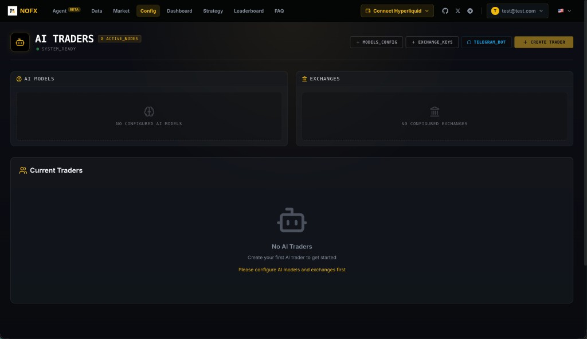
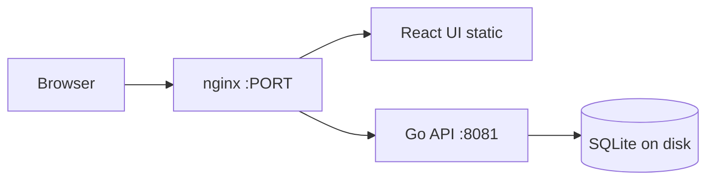

# NOFX on Render

> One-click self-hosted NOFX: an AI-powered trading terminal with multi-exchange support, strategy studio, and a conversational agent.

[](https://render.com/deploy-template/api/github/start?template_repo=nofx-render-template)

This template packages [NOFX](https://github.com/NoFxAiOS/nofx) for Render using official `ghcr.io/nofxaios/nofx` Docker images merged into a single container. You get nginx (UI + reverse proxy), the Go API, and SQLite on a persistent disk without building the upstream monorepo on Render. Fork the template into your GitHub account, apply the Blueprint, then create your admin account on first visit.



> **Gallery listing:** GitHub repo is live at [render-examples/nofx-render-template](https://github.com/render-examples/nofx-render-template). Catalog entry pending Sanity CMS — see [SANITY-SUBMISSION.md](./SANITY-SUBMISSION.md).

**Live demo:** https://nofx-scgi.onrender.com/

---

## Table of contents

- [Why deploy NOFX on Render](#why-deploy-nofx-on-render)
- [Use cases](#use-cases)
- [What gets deployed](#what-gets-deployed)
- [Quickstart](#quickstart)
- [Configuration](#configuration)
- [Cost breakdown](#cost-breakdown)
- [Customization](#customization)
- [Operations](#operations)
- [Upgrading](#upgrading)
- [Troubleshooting](#troubleshooting)
- [FAQ](#faq)
- [Security](#security)
- [Caveats and limitations](#caveats-and-limitations)
- [Credits and license](#credits-and-license)

---

## Why deploy NOFX on Render

- **Official upstream images** — Backend and frontend are pulled from GHCR at deploy time; no multi-stage Node/Go build on Render.
- **Persistent SQLite** — A 5 GB disk at `/app/data` keeps traders, strategies, and exchange configs across deploys and restarts.
- **Secrets wired in the Blueprint** — `JWT_SECRET` and `DATA_ENCRYPTION_KEY` are auto-generated; RSA keys are created on first boot if missing.
- **Single service footprint** — One web service handles UI, API proxy, and background trading logic; good for demos and small deployments.

---

## Use cases

- **Personal AI trading lab** — Connect Hyperliquid, OKX, or other exchanges and test strategies with LLM-assisted configuration.
- **Strategy prototyping** — Use the Agent chat to describe traders in natural language before wiring API keys in Config.
- **Team demo environment** — Spin up an isolated NOFX instance per engineer via the one-click template fork.
- **24/7 paper or live bots** — Keep traders running on Render's always-on Starter plan (upgrade if you need more CPU/RAM).

---

## What gets deployed



| Resource | Type | Plan | Purpose |
|----------|------|------|---------|
| `nofx` | Web (Docker) | Starter | nginx + Go API + React UI |
| `nofx-data` | Disk 5 GB | — | SQLite at `/app/data/data.db` |

Region: **Oregon** (`oregon`). Change `region` in `render.yaml` before deploy if you need another region.

Image source: `ghcr.io/nofxaios/nofx/nofx-backend:latest` and `nofx-frontend:latest` (see [Upgrading](#upgrading) to pin tags).

---

## Quickstart

1. Click **[Deploy to Render](https://render.com/deploy-template/api/github/start?template_repo=nofx-render-template)**. GitHub creates a fork of this template in your account.
2. Review auto-generated secrets (`JWT_SECRET`, `DATA_ENCRYPTION_KEY`). Do not change them after first deploy unless you understand the migration impact.
3. Click **Apply**. First deploy typically takes **5–10 minutes** (Docker pull, disk attach, container start).
4. Open your service URL (`https://nofx-xxxx.onrender.com/`). If the system is not initialized, you will see the **registration** screen — create the single admin account (only one user is allowed).
5. Sign in, open **Config**, add **AI models** and **exchange keys**, then **Create Trader** or use the **Agent** tab.

---

## Configuration

### Required secrets

None at Blueprint apply time. LLM and exchange credentials are configured in the NOFX UI after login.

### Auto-generated secrets

| Env var | Purpose |
|---------|---------|
| `JWT_SECRET` | Session tokens for the API |
| `DATA_ENCRYPTION_KEY` | Encrypts sensitive fields at rest |
| `RSA_PRIVATE_KEY` | Generated on first boot by `railway/start.sh` if unset |

**Do not rotate `JWT_SECRET` or `DATA_ENCRYPTION_KEY` casually** after traders and exchange keys are stored: existing sessions and encrypted data may break.

### Wired automatically

| Env var | Value / source |
|---------|----------------|
| `DB_TYPE` | `sqlite` |
| `DB_PATH` | `/app/data/data.db` |
| `TZ` | `UTC` |
| `TRANSPORT_ENCRYPTION` | `false` (TLS terminates at Render) |
| `AI_MAX_TOKENS` | `8000` |
| `PORT` | Set by Render; nginx listens here |

### Optional tweaks

| Env var | Default | Notes |
|---------|---------|-------|
| `TRANSPORT_ENCRYPTION` | `false` | Leave off on Render; HTTPS is provided by the platform |
| `AI_MAX_TOKENS` | `8000` | Raise if long agent responses truncate |
| Plan | `starter` | Bump to `standard` if the container OOMs during heavy agent workloads |

Configure in the UI (not env vars): OpenAI, Anthropic, DeepSeek, custom LLM endpoints, exchange API keys, Telegram bot token.

---

## Cost breakdown

| Resource | Plan | Approx. monthly (USD) |
|----------|------|------------------------|
| Web service | Starter | ~$7 |
| Persistent disk | 5 GB | ~$5 |
| **Total** | | **~$12** |

Free tier is not recommended: the service sleeps after inactivity and cold starts can cause transient API errors during login or registration.

External costs (LLM API usage, exchange fees, Telegram) are billed by those providers, not Render.

---

## Customization

### Pin upstream image versions

Edit `Dockerfile.railway` and replace `:latest` with a specific tag from [NOFX GHCR packages](https://github.com/orgs/NoFxAiOS/packages):

```dockerfile
FROM ghcr.io/nofxaios/nofx/nofx-backend:1.0.0 AS backend
FROM ghcr.io/nofxaios/nofx/nofx-frontend:1.0.0 AS frontend
```

Redeploy after changing tags.

### Custom domain

In the Render dashboard: **Settings → Custom Domains** on the `nofx` service. TLS certificates are managed by Render.

### Larger SQLite or uploads

Increase `disk.sizeGB` in `render.yaml` (requires Blueprint update and redeploy). SQLite stays at `DB_PATH=/app/data/data.db`.

### Switch region

Change `region` under the web service in `render.yaml` before first deploy, or migrate manually by creating a new service in the target region.

---

## Operations

### Backups

Copy `/app/data/data.db` periodically via Render Shell or a one-off job. Render disk snapshots are not a substitute for application-level backup if you rely on trader history.

### Monitoring

- Health check: `GET /health` (nginx only, returns 200)
- Backend check: `GET /api/health` on your service URL
- Logs: Render dashboard → **Logs** for the `nofx` service

### Scaling

This template runs a **single instance** with SQLite on a mounted disk. Horizontal scaling is not supported without migrating to Postgres and re-architecting. Vertical scaling: upgrade plan in the dashboard.

### Logs

Container stdout includes nginx and Go API output. Use structured log search in the Render dashboard for `REGISTRATION_ERROR` or `502` during cold starts.

---

## Upgrading

1. Check [NoFxAiOS/nofx releases](https://github.com/NoFxAiOS/nofx/releases) for new GHCR tags.
2. Pin or update tags in `Dockerfile.railway` in your fork.
3. Trigger **Manual Deploy** on Render.

Read upstream release notes for database migrations or breaking API changes before upgrading production traders.

---

## Troubleshooting

### Registration shows "Server error"

Often a cold start on Starter/Free: wait 30–60 seconds and retry. Confirm `GET /api/health` returns 200. If the system is already initialized (`GET /api/config` → `"initialized": true`), use **Login** instead of Register.

### Toast: "API Not Found" (404)

The frontend treats any HTTP 404 as this message. Some routes (for example legacy prompt-template endpoints) may 404 while the app is still usable. Verify core endpoints: `/api/config`, `/api/health`.

### Health check passes but UI cannot log in

Ensure the disk is mounted at `/app/data` and `DB_PATH` matches. A missing disk resets SQLite on every deploy.

### Docker pull fails for GHCR images

Confirm `ghcr.io/nofxaios/nofx/*` images are public and the tag exists. Pin to a known-good tag if `:latest` moved.

### Out of memory

Upgrade from Starter to Standard if the Go process or agent workloads exit during startup.

---

## FAQ

**Can I have multiple admin users?**  
NOFX uses single-user onboarding: the first registration closes public signup.

**Where do I set OpenAI or Hyperliquid keys?**  
In the web UI under **Config** after login, not in Render env vars.

**Does `/health` prove the API is up?**  
No. It only checks nginx. Use `/api/health` for the Go backend.

**Can I reset a forgotten password on Render?**  
Use the upstream CLI (`nofx reset-password`) via Render Shell if documented in the NOFX repo; there is no public forgot-password flow on ephemeral demos.

**Is this financial advice?**  
No. NOFX is trading software. You are responsible for compliance, risk, and API key security.

**Why AGPL for upstream?**  
The application is AGPL-3.0. This template wrapper is MIT; running modified NOFX may have copyleft obligations — read upstream [LICENSE](https://github.com/NoFxAiOS/nofx/blob/main/LICENSE).

---

## Security

- TLS terminates at Render; keep `TRANSPORT_ENCRYPTION=false` unless you add internal mTLS.
- Store exchange and LLM keys only in the encrypted UI/config layer; do not commit them to your fork.
- Rotate compromised API keys at the provider; consider redeploying with new `DATA_ENCRYPTION_KEY` only if you understand data loss implications.
- Report vulnerabilities in upstream NOFX via the [NoFxAiOS/nofx](https://github.com/NoFxAiOS/nofx) security policy.

---

## Caveats and limitations

- **SQLite + single disk** — One Render instance only; not HA.
- **`:latest` images** — Reproducibility requires pinning tags in your fork.
- **Starter spin-down** — Free/idle services cause slow first requests.
- **Trading risk** — Live keys on a cloud VM require your own security review.
- **AGPL upstream** — Distribution of modified NOFX may require source disclosure; consult your legal team.

---

## Credits and license

- **Template wrapper** (this repo): MIT — see [LICENSE](./LICENSE).
- **NOFX application**: [AGPL-3.0](https://github.com/NoFxAiOS/nofx/blob/main/LICENSE) by [NoFxAiOS](https://github.com/NoFxAiOS/nofx).
- **Render template pattern**: inspired by other [render-examples](https://github.com/render-examples) gallery templates.

Maintained as a community template; not affiliated with NoFxAiOS or Render beyond the examples program.
