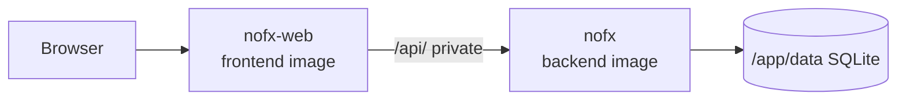

<div align="center">

# NOFX on Render

Deploy **NOFX**, the AI trading terminal, on Render with official GHCR backend and frontend images plus SQLite on a persistent disk.

<p>
  <a href="https://render.com/deploy-template/api/github/start?template_repo=nofx-render-template">
    
  </a>
</p>

<p>
  <a href="https://render.com">
    
  </a>
  <a href="https://github.com/NoFxAiOS/nofx">
    
  </a>
  <a href="https://github.com/orgs/NoFxAiOS/packages">
    
  </a>
</p>

</div>


## What This Template Shows

This repo packages NOFX's official GHCR images as a one-click Render Blueprint. No Go/source build on Render.

| Piece | Role |
| --- | --- |
| **[NOFX](https://github.com/NoFxAiOS/nofx)** | AI trading terminal (multi-exchange + LLM) |
| **[nofx-backend](https://github.com/orgs/NoFxAiOS/packages)** | Private API image + SQLite disk |
| **[nofx-frontend](https://github.com/orgs/NoFxAiOS/packages)** | Public UI (nginx proxies `/api/` to backend) |
| **[Render Private Service](https://render.com/docs/private-services)** | `nofx` API on the private network |
| **[Render Web Service](https://render.com/docs/web-services)** | `nofx-web` public UI |
| **[Render Disk](https://render.com/docs/disks)** | SQLite at `/app/data` |

## Architecture



### How It Works

1. Click **Deploy to Render**. Render forks this template and applies [`render.yaml`](./render.yaml).
2. Render pulls `nofx-backend` and `nofx-frontend` from GHCR.
3. Open the **`nofx-web`** URL (not the private backend).
4. Sign in / configure exchanges and LLM providers in the UI.
5. Data persists on the backend disk across deploys.

| Resource | Type | Plan | Notes |
| --- | --- | --- | --- |
| `nofx` | Private (`runtime: image`) | **starter** | Must stay named `nofx` (frontend proxies to `http://nofx:8080`) |
| `nofx-web` | Web (`runtime: image`) | **starter** | Health `/health`; public URL |
| `nofx-data` | Disk (5 GB) |  | Mounted on backend at `/app/data` |

Default region: **oregon**. Previews are off. Pin image tags in `render.yaml` for production (Blueprint currently uses `:latest`).

## Quick Start

### Prerequisites

- A [Render account](https://dashboard.render.com/register?utm_source=github&utm_medium=referral&utm_campaign=ojus_demos&utm_content=readme_link)
- Exchange / LLM credentials configured in the NOFX UI after deploy

### Deploy

1. Click **Deploy to Render** above and fork into your GitHub account.
2. On Apply, confirm `nofx` (private) and `nofx-web` (public).
3. Wait until services are **Live** (~3–8 minutes).
4. Open the **`nofx-web`** URL and finish setup.
5. Configure API keys in the product UI.

Health check:

```bash
curl -sS -o /dev/null -w "%{http_code}\n" https://<your-nofx-web>.onrender.com/health
```

## Features

| Feature | Description |
| --- | --- |
| **Official images** | GHCR backend + frontend; no source build |
| **Private API** | Backend not on the public internet |
| **Persistent SQLite** | 5 GB disk on the backend |
| **Generated secrets** | `JWT_SECRET`, `DATA_ENCRYPTION_KEY` |
| **One-click Blueprint** | `projects` / `environments` wrapper |

## Configuration

| Variable | Source | Description |
| --- | --- | --- |
| `DB_TYPE` / `DB_PATH` | Wired | SQLite at `/app/data/data.db` |
| `TZ` | Wired | `UTC` |
| `TRANSPORT_ENCRYPTION` | Wired | `false` (template default) |
| `AI_MAX_TOKENS` | Wired | `8000` |
| `JWT_SECRET` | Auto-generated | Auth signing |
| `DATA_ENCRYPTION_KEY` | Auto-generated | Data at rest in app |

Exchange and LLM credentials are set in the NOFX UI after deploy.

### Pin images

```yaml
image:
  url: ghcr.io/nofxaios/nofx/nofx-backend:<tag>
```

`autoDeployTrigger: off` so floating tags do not redeploy until **Manual Deploy**.

## Cost

| Resource | Approx. monthly |
| --- | ---: |
| `nofx` private (Starter) | ~$7 |
| `nofx-web` (Starter) | ~$7 |
| Disk (5 GB) | ~$1.25 |
| **Total** | **~$15–16** |

Exchange/LLM fees are separate. Keep both services in the same region and do not rename `nofx`.

## Troubleshooting

| Problem | Solution |
| --- | --- |
| UI loads but API fails | Backend service must be named `nofx`; check private network / logs. |
| Health check fails on web | Confirm `nofx-web` image pull; retry Manual Deploy. |
| Data lost after redeploy | Disk must remain on `nofx` at `/app/data`. |
| Image pull failures | Confirm GHCR package visibility / tag exists; retry deploy. |

## Project Structure

```
render.yaml       Render Blueprint (images + disk)
README.md         This file
LICENSE           MIT (template wrapper)
.env.example      Optional notes
assets/           Hero
```

## Learn More

**Render:**
- [Web Services](https://render.com/docs/web-services)
- [Private Services](https://render.com/docs/private-services)
- [Disks](https://render.com/docs/disks)
- [Blueprints](https://render.com/docs/infrastructure-as-code)

**NOFX:**
- [Upstream repo](https://github.com/NoFxAiOS/nofx)
- [GHCR packages](https://github.com/orgs/NoFxAiOS/packages)

## License

[MIT](LICENSE) for this template wrapper.

Upstream [NOFX](https://github.com/NoFxAiOS/nofx) license: see upstream repo. Star that project if this helped.
